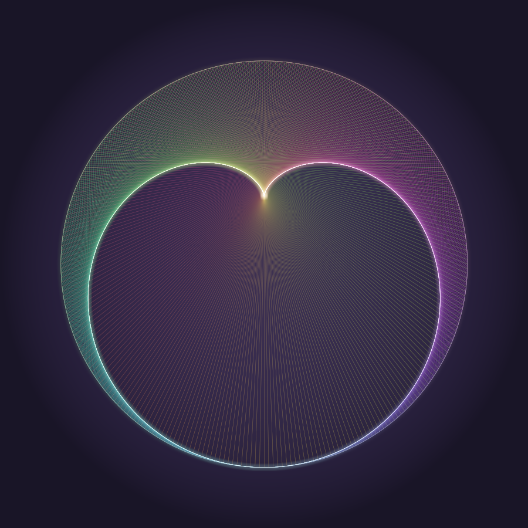

# cardioid

A single-file C++ program that renders a multi-colored cardioid to a PNG. No
image library, no framework. The only dependency is zlib, and only for PNG
deflate and crc32.



## Build and run

```
c++ -O2 -std=c++17 cardioid.cpp -lz -o cardioid && ./cardioid
```

Renders `cardioid.png` in about a second.

## How the picture is made

Nothing in the program draws a heart. Two constructions do the work, and they
happen to be the same curve.

1. **The times-2 table.** Join point `t` on a circle to point `2t`, a few
   hundred times. Every one of those chords is tangent to a cardioid, so the
   curve appears as the gap the threads leave behind. Classic string art.
2. **The analytic envelope**, drawn bright on top. The chord joining circle
   angles `t` and `2t` lies on the line

   ```
   x*cos(3t/2) + y*sin(3t/2) = cos(t/2)
   ```

   Solving `F = 0` together with `dF/dt = 0` gives the envelope

   ```
   P(t) = 2/3 * (cos t, sin t) + 1/3 * (cos 2t, sin 2t)
   ```

   a unit-circle epicycloid. For a general multiplier `k` the same derivation
   gives `k/(k+1) * (cos t, sin t) + 1/(k+1) * (cos kt, sin kt)`.

Color is a hue sweep over the parameter. Chords are blended additively in a
linear-light float buffer (bilinear splats, so lines land antialiased without a
separate pass), supersampled 2x, bloomed with separable box blurs, tone mapped
with `1 - exp(-v * exposure)`, and gamma encoded to sRGB. The PNG is written by
hand: filter-byte scanlines, `compress2`, then IHDR/IDAT/IEND with CRCs.

## Options

| flag | default | what it does |
| --- | --- | --- |
| `--size N` | 1400 | output edge length in pixels |
| `--lines N` | 560 | number of chords in the web |
| `--mult K` | 2 | the times-table multiplier |
| `--spin DEG` | -90 | rotation; the cusp lands opposite this direction |
| `--ink F` | 5.0 | chord brightness |
| `--exposure F` | 2.0 | tone-map exposure |
| `--out PATH` | cardioid.png | output file |

Two are worth playing with. `--mult 3` gives a nephroid and `--mult 4` a
three-cusped curve; the envelope formula generalizes, so the bright overlay
follows along. `--ink` is the one that decides whether the image reads at all:
push the chord count and brightness too high and every channel clips to white,
turning the whole web into flat milk. Fewer, brighter threads is what lets the
hues show.
