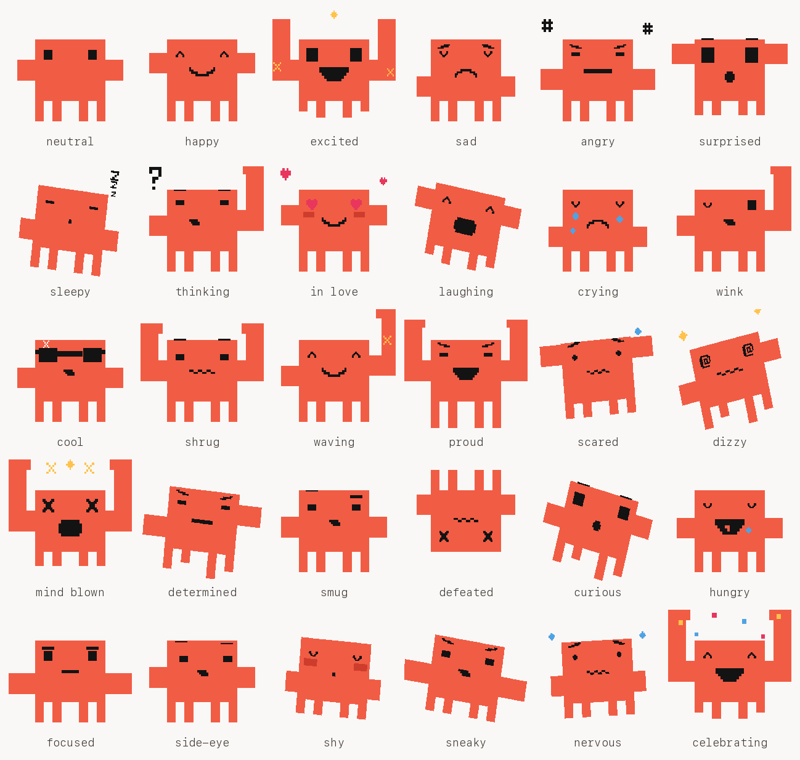

# clawd-poses

Thirty poses and expressions for Clawd, drawn on the same grid as the original
icon so every one of them stays on-model.



## Why it is drawn, not generated

The source icon ([homarr-labs/dashboard-icons `clawd.webp`](https://cdn.jsdelivr.net/gh/homarr-labs/dashboard-icons/webp/clawd.webp))
is pixel art on a regular grid, which image models reliably mangle. Measuring
the 400px original gives a clean 32px unit and an exact anatomy:

| part | geometry                                                |
| ---- | ------------------------------------------------------- |
| body | 8 x 8 units                                             |
| arms | 2 x 2, flush to the left and right edges, rows 2-4       |
| eyes | 1 x 1 at body-local (1, 1) and (6, 1)                   |
| legs | four 1-unit legs, carved from body-local row 6 down     |
| fill | `#f15c45`, features `#131313`                            |

`clawd_poses.py` works entirely in those units, so a pose is a handful of rects
that land on the grid instead of a prompt that hopes to.

## Running it

```
python3 clawd_poses.py            # -> out/
python3 clawd_poses.py <dir>      # -> somewhere else
```

Needs Pillow, nothing else. Each pose is written as both a transparent PNG
(672 x 576, nearest-neighbour, no anti-aliasing) and an SVG of the same rects,
plus `clawd-moods.png`, the labelled contact sheet above.

## Adding a pose

A pose is a list of rects and a tilt. The pieces compose:

```python
add(
    "smitten",
    "smitten",
    base(ly=ARM_Y - 0.5, ry=ARM_Y - 0.5)   # torso + legs + arms
    + eyes("heart", 1.25, PINK)
    + mouth("smile")
    + blush()
    + glyph(HEART, 0.9, 0.9, 1.2, 1.2, PINK),
    tilt=-5,
)
```

- `eyes`, `brows`, and `mouth` pull from the `EYES` / `BROWS` / `MOUTHS`
  dictionaries, which are `'#'`/`'.'` character grids scaled into a unit box.
  Draw a new expression by adding a grid, not by computing coordinates.
- `arm(side, y, length, rise, hand)` is a horizontal limb flush to a body edge,
  with an optional forearm rising from its outer end. A raised forearm is forced
  out to at least 3 units, because flush against the body it reads as an ear.
- `glyph` places any character grid anywhere, which is what the floating `?`,
  zzz, hearts, sweat, stars and confetti are.
- `tilt` rotates the finished image with nearest-neighbour, so the blocks stay
  hard-edged.

Limbs are body-coloured, so anything drawn over the torso disappears. Poses have
to read from the silhouette.
